<div align="center">

## `gayatri-015@github ~ $ ./contributions.sh`



---

## `gayatri-015@github ~ $ whoami`

| | |
|---|---|
|  |  |

---

## `gayatri-015@github ~ $ cat about.md`

```
╔══════════════════════════════════════════════════════════════╗
║                   👋 Hi, I'm Gayatri                         ║
║      Computer Science Engineering Student                    ║
║         Full Stack Developer | AI/ML Enthusiast              ║
╚══════════════════════════════════════════════════════════════╝
```

### 💻 Tech Stack

**Languages**


**Frameworks & Tools**


**AI / ML**


---

## `gayatri-015@github ~ $ ls -la projects/`

### 🤟 Indian Sign Language Recognition
Research-oriented Indian Sign Language Recognition system using computer vision and deep learning.

**Tech:** `Computer Vision` `Deep Learning` `Transformers` `Python`

---

### 📰 Fake News Detection
Machine-learning based system for detecting fake and real news using NLP and TF-IDF.

**Tech:** `Python` `Scikit-learn` `NLP` `Streamlit`

---

### 🌦️ Weather Forecasting
Machine-learning based weather forecasting and comparison project.

**Tech:** `Python` `AI/ML` `Weather Models`

---

## `gayatri-015@github ~ $ cat learning.txt`

```
┌─────────────────────────────────────────┐
│ 🔥 Current Focus                        │
├─────────────────────────────────────────┤
│ 🐍 Python Full Stack Development         │
│ 🧠 Data Structures & Algorithms          │
│ 🤖 Artificial Intelligence               │
│ 👁️ Computer Vision                       │
│ 🤟 Indian Sign Language Recognition      │
│ 🌐 Full Stack Web Development             │
└─────────────────────────────────────────┘
```

---

## `gayatri-015@github ~ $ connect.sh`

[](https://github.com/Gayatri-015)
[](https://www.linkedin.com/in/gayatri)

---

<p align="center">

```
╔════════════════════════════════════════╗
║                                        ║
║    "Code. Learn. Build. Repeat."       ║
║                                        ║
║    Let's build something awesome 🚀    ║
║                                        ║
╚════════════════════════════════════════╝
```

**Thanks for visiting my profile!**

</p>

</div>